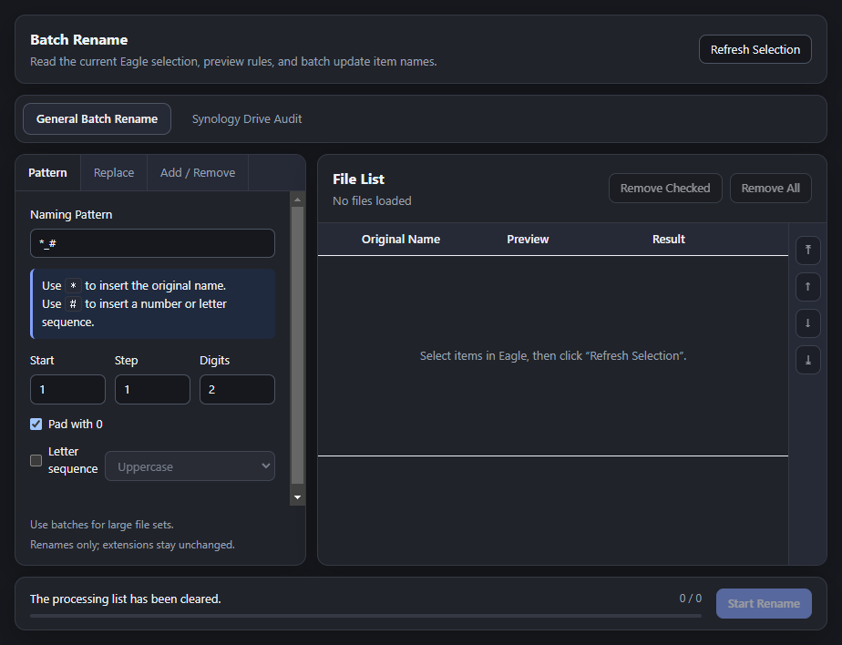
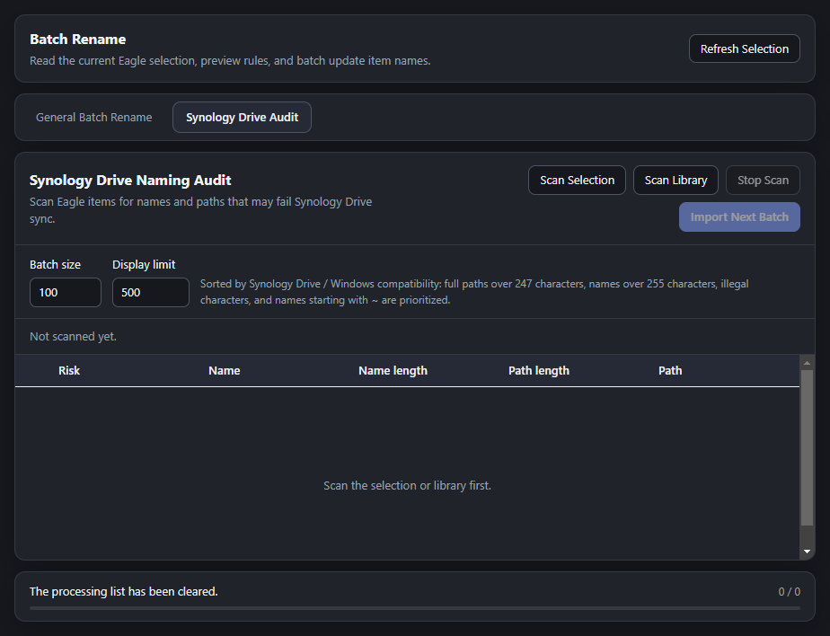

# Batch Rename for Eagle

Batch Rename is an Eagle plugin for previewing rename rules and safely updating selected item names in bulk.

It supports pattern-based naming, text replacement, prefix/suffix operations, positional insert/delete, duplicate detection, item-level progress, and a Synology Drive naming audit for users who need to find names or paths that may fail NAS sync.

## Features

- **Batch rename selected Eagle items** with a live preview before saving.
- **Pattern rules** using `*` for the original name and `#` for number or letter sequences.
- **Replace, add, and remove operations** for common filename cleanup workflows.
- **Safety checks** for duplicate names, empty names, illegal characters, trailing spaces or dots, and overly long names.
- **Adaptive saving** that switches between single-channel and parallel processing based on batch size.
- **Synology Drive audit** for path length, name length, illegal characters, leading `~`, trailing spaces/dots, and Windows reserved names.
- **Localized UI** for English, Simplified Chinese, and Traditional Chinese.
- **Theme-aware interface** that follows Eagle light and dark themes.

## Screenshots

### General Batch Rename



### Synology Drive Audit



## Installation

1. Download the latest release package.
2. Install the `.eagleplugin` file in Eagle.
3. Select items in Eagle and open **Batch Rename** from the plugin list.

If you are installing from source, keep the project structure unchanged and package the plugin root as an Eagle plugin bundle.

## Usage

1. Select images, videos, or other items in Eagle.
2. Open the plugin and click **Refresh Selection**.
3. Choose a rename module:
   - **Pattern**: use `*` for the original name and `#` for an auto-incrementing sequence.
   - **Replace**: find and replace text in item names.
   - **Add / Remove**: add prefixes or suffixes, insert text by position, or delete text by position.
4. Review the preview and validation result for every item.
5. Click **Start Rename**.
6. For NAS backup preparation, open **Synology Drive Audit**, scan selected items or the library, and import risky items into the rename list in batches.

## Important Notes

- The plugin changes Eagle item names only. It does not modify file extensions.
- Already saved items are not rolled back if a running task is stopped.
- Large batches are processed adaptively, but very large libraries should be audited and imported in smaller batches.
- Synology Drive checks are compatibility heuristics for common Windows and Synology Drive sync failures; users should still verify their own NAS sync rules.

## Repository Structure

```text
.
├── _locales/              # English, Simplified Chinese, Traditional Chinese strings
├── assets/upload/         # Listing copy, cover images, icon exports, release package
├── css/                   # Plugin styles
├── js/                    # Plugin logic
├── index.html             # Plugin entry
├── logo.png               # Plugin icon used by manifest
└── manifest.json          # Eagle plugin manifest
```

## Compatibility

- Eagle plugin platform: `all`
- Eagle plugin architecture: `all`
- UI languages: `en`, `zh_CN`, `zh_TW`

## License

This project is released under the MIT License.
